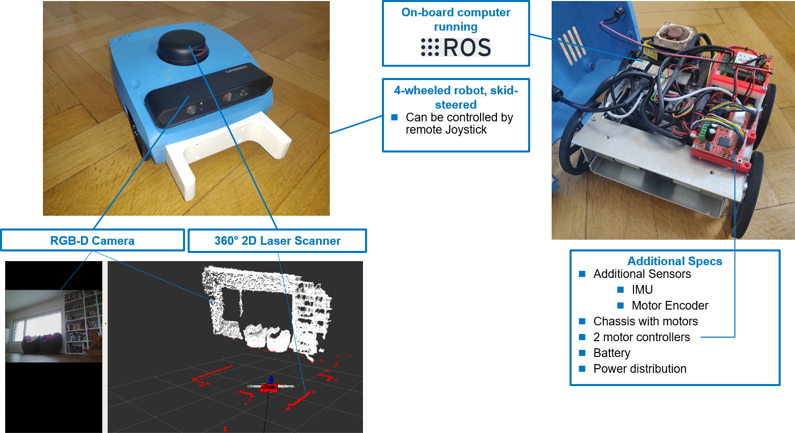
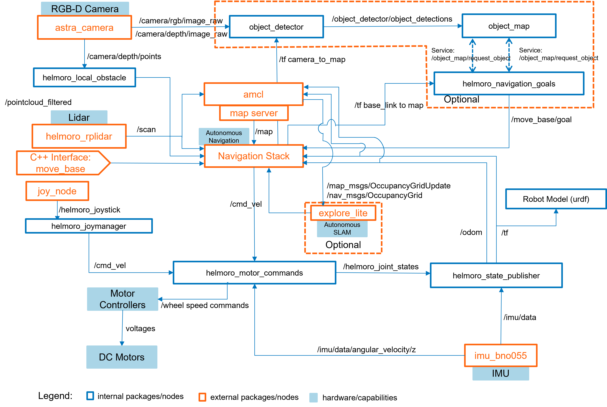
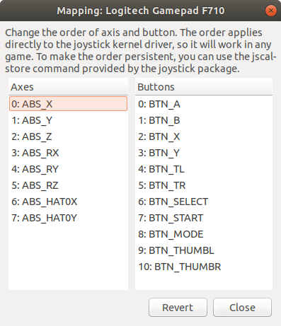
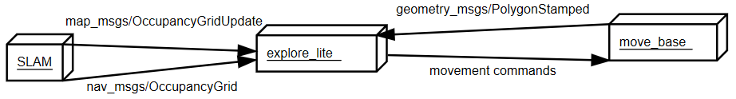

**\*This is the GIT repository for the ROS architecture of the **Hel**bling **Mo**bile **Ro**bot.\***

# Introduction

Helmoro is a four wheeled, skid steered navigation robot, equipped with:

- 4 DC-Motors and 4 angular encoders
- 4 2 [Roboclaw Motor Controllers](https://www.basicmicro.com/Roboclaw-2x7A-Motor-Controller_p_55.html) to control their motion.
- 1 Lidar ([RPLidar Slamtec](https://www.slamtec.com/en/Lidar/A2))
- 1 RGB-D camera ([Orbbec Astra Pro](https://orbbec3d.com/product-astra-pro/))
- 1 IMU ([Adafruit BNO055 Absolut Orientation](https://learn.adafruit.com/adafruit-bno055-absolute-orientation-sensor))
- 1 [NVIDIA Jetson Nano Developer Kit](https://developer.nvidia.com/embedded/jetson-nano-developer-kit) with Ubuntu 18.04

Helmoro is developed by HTKZ T1175. A second Helmoro (Helmoro orange) exists at HTKA. An overview of Helmoro's components is shown in the following picture.



Helmoro has the following capabilities, which can be used also within a Gazebo simulation ([Simulation](#simulation)):

- Video, map and position streaming to local computer
- Remote joystick control
- Autonomous Navigation to set goal positions
- Object detection and autonomous pickup [video](<\htkzsrv005\projekte\T1110\110038300_DLE Autonomous Navigation\09_Bilder_Filme\2021-01-27 Helmoro Picks\05_02_2021_Commit_fe100f7f7d\Helmoro_front_pickup_big_fork_3_tries.mp4>)
- Remote controlled mapping
- Autonomous mapping
- Finger gesture as commands for Autonomous pickup [WIP]

# Quick Start Guide

After setting up ROS and (in the best case) all needed repositories on your computer following [Install](#install) you can use Helmoro. Helmoro can be run in simulation using gazebo locally on your computer or as a real robot. If you require more information and tips read chapter [Usage](#Usage).

## Setup

### Real Robot

To run Helmoro in reality you need to set your own computer up to communicate with Helmoro. You need to find out Helmoro's IP, if Helmoro is in the Lab-network at HTKZ you can find it under [here](http://intranet/grpit/DHCP_HTKZ-Labor.asp) under the following name and MAC-addresses:

- Helmoro 1:
  - computername: `helmoro-blue`
  - MAC-address: `98-af-65-f4-08-21`
  - User: `helmoro`
  - Password `htkz`
- Helmoro 2:
  - computername: `helmoro-orange`
  - MAC-address: `0c-dd-24-97-be-b3`
  - User: `helmoro`
  - Password `htkz`

With the following commands in all terminals:

```sh
export ROS_IP=$<Your_IP>
export ROS_MASTER_URI=http://<Helmoro_IP_address>:11311
```

`<Your_IP>` being the IP of your linux system and `<Helmoro_IP_address>` being the IP of Helmoro in your used network. More info under [Run](#run).

To run commands on Helmoro you will need to ssh into the NVIDIA Jetson:

```sh
ssh <username>@<Helmoro_IP_address>
```

After executing the desired `launch file` (see below in [Launching](#launching)) you need to run

```sh
rosrun rviz rviz -d `rospack find helmoro_description`/rviz/rviz_config.rviz
```

on your computer for visualization RVIZ.

For remote control of velocity and the commanding of autonomous object pickup the joystick:

```sh
 roslaunch helmoro_joymanager joymanager.launch
```

Make sure to connect the joystick to your VM.

The default environment is the 9th floor at HTKZ. It might be necessary to give Helmoro a initial position estimate using RVIZ. More Info can be found in [Usage](#usage).

### Simulation

To run Helmoro in simulation just add

```sh
is_real_robot:=false use_rviz:=true use_gui:=true
```

to the end of the roslaunch command shown in [Launching](#launching). This will start virtual Helmoro, RVIZ, Gazebo and the joystick reader on your local computer.

## Launching

Run these commands on Helmoro or locally depending on your desired [Setup](#setup).

### Joystick control

You can drive Helmoro around using the Logitech joystick: The left and right triggers are x-velocity and the left analogue stick controls the rotation.

```sh
roslaunch helmoro_description helmoro.launch
```

Make sure to slightly touch both triggers to initialize the joystick.

### Autonomous Navigation to set goal positions

Helmoro can navigate in a given space using the ROS Navigation Stack avoiding static and dynamic obstacles along the calculated path. In this mode it is possible to send helmoro to goals using RVIZ and use every functionality from [joystick control](#joystick-control). You need to use Helmoro in a premapped environment like the 9th floor of the obsidian. To run this in new environment, first a map needs to be created with [Remote controlled mapping](#remote-controlled-mapping) or [Autonomous mapping](#autonomous-mapping)

```sh
roslaunch helmoro_description nav_helmoro.launch
```

More information can be found in the chapter [Autonomous Navigation using the Navigation Stack](#autonomous-Navigation-using-the-Navigation-Stack).

### Object detection and autonomous pickup

In this mode Helmoro saves the location of objects, which he sees with his camera, in a map. The objects are displayed in RVIZ. Afterwards he can be commanded to bring the object back to a before specified location (`global goal` in `helmoro_navigation_goals/param/parameters.yaml`).  
After Helmoro detected the objects, the user can pick a color using the colored buttons on the joystick. Afterwards he can push start to command Helmoro to get the most often seen object. The back button cancels all autonomous actions from Helmoro.

```sh
roslaunch helmoro_description showcase_helmoro.launch
```

More information on the detection of object can be found in chapter [object_detector](#object_detector) and about the storage of the objects in a map in chapter [object map](#object_map).

### Remote controlled mapping

Helmoro can make use of a SLAM algorithm called gmapping, that uses the laser scans from the lidar and the odometry information coming from encoders and IMU in order to build a map of obstacles.

```sh
roslaunch helmoro_description gmapping_helmoro.launch
```

For this to work, Helmoro can be remotely driven around by joystick until the map is fully registered. You can follow the status in RVIZ, when looking at the `occupancy map`. When finished run in a separate terminal on Helmoro

```sh
rosrun map_server map_saver -f <location and name of your_map>
```

will save the map for later use (edit `move_base.launch` accordingly).

More detailed information can be found in [SLAM using gmapping](#slam-using-gmapping)

### Autonomous mapping

With the help of the `explore_lite` package Helmoro is able to map his environment by himself.

```sh
roslaunch helmoro_description explore_helmoro.launch
```

You can follow the status in RVIZ, when looking at the `occupancy map`. When finished run in a separate terminal on Helmoro

```sh
rosrun map_server map_saver -f <location and name of your_map>
```

will save the map for later use (edit `move_base.launch` accordingly).

More detailed information can be found in [Autonomous SLAM using explore_lite](#autonomous-SLAM-using-explore_lite)

### Finger gesture as commands for autonomous pickup

Helmoro can recognize gestures shown at its RGB-D camera using the [gesture input package], depending on mediapipe from google. Through it, Helmoro can be shown several numbers from 0 to 5 by hand, which he is capable interpreting.

This feature is still in development and needs to be integrated with the rest. More information can be found in chapter [hand_detector](#hand_detector).

# Table of Contents

- [Introduction](#introduction)
- [Quick Start Guide](#quick-start-guide)
  - [Setup](#setup)
    - [Real Robot](#real-robot)
    - [Simulation](#simulation)
  - [Launching](#launching)
    - [Joystick control](#joystick-control)
    - [Autonomous Navigation to set goal positions](#autonomous-navigation-to-set-goal-positions)
    - [Object detection and autonomous pickup](#object-detection-and-autonomous-pickup)
    - [Remote controlled mapping](#remote-controlled-mapping)
    - [Autonomous mapping](#autonomous-mapping)
    - [Finger gesture as commands for autonomous pickup](#finger-gesture-as-commands-for-autonomous-pickup)
- [Table of Contents](#table-of-contents)
- [Showcase](#showcase)
  - [Idea](#idea)
  - [Limitations](#limitations)
- [Detailed Usage](#detailed-usage)
  - [Run](#run)
    - [Running ROS across Multiple Machines](#running-ros-across-multiple-machines)
    - [Run RViZ with a config file](#run-rviz-with-a-config-file)
  - [Arguments](#arguments)
    - [Usage Arguments](#usage-arguments)
    - [RVIZ Arguments](#rviz-arguments)
    - [Gazebo Arguments](#gazebo-arguments)
    - [Common commands](#common-commands)
      - [Advanced usage or tuning](#advanced-usage-or-tuning)
- [Architectural Overview](#architectural-overview)
- [Packages](#packages)
  - [helmoro_description](#helmoro_description)
    - [launch files](#launch-files)
    - [param](#param)
    - [urdf and meshes](#urdf-and-meshes)
    - [rviz](#rviz)
  - [helmoro_msgs](#helmoro_msgs)
  - [helmoro_joymanager](#helmoro_joymanager)
    - [launch files](#launch-files-1)
    - [nodes](#nodes)
  - [helmoro_motor_commands](#helmoro_motor_commands)
    - [nodes](#nodes-1)
    - [comments](#comments)
    - [troubleshooting](#troubleshooting)
  - [helmoro_gazebo_plugin](#helmoro_gazebo_plugin)
    - [nodes](#nodes-2)
    - [worlds](#worlds)
  - [helmoro_state_publisher](#helmoro_state_publisher)
    - [nodes](#nodes-3)
  - [helmoro_local_obstacle](#helmoro_local_obstacle)
    - [nodes](#nodes-4)
  - [helmoro_2dnav](#helmoro_2dnav)
  - [object_detector](#object_detector)
    - [Description](#description)
    - [Limitations](#limitations-1)
    - [nodes](#nodes-5)
  - [object_map](#object_map)
    - [nodes](#nodes-6)
    - [comments](#comments-1)
  - [hand_detector](#hand_detector)
    - [Limitations](#limitations-2)
  - [helmoro_navigation_goals](#helmoro_navigation_goals)
    - [nodes](#nodes-7)
- [Install](#install)
  - [Dependencies](#dependencies)
    - [Overview](#overview)
    - [catkin_simple](#catkin_simple)
    - [any_node](#any_node)
    - [joystic_drivers stack](#joystic_drivers-stack)
    - [helmoro_rplidar](#helmoro_rplidar)
    - [ros_astra_camera](#ros_astra_camera)
    - [ros_imu_bno055](#ros_imu_bno055)
    - [gmapping](#gmapping)
    - [Navigation Stack](#navigation-stack)
    - [explore_lite](#explore_lite)
    - [OpenCV](#opencv)
      - [Background](#background)
      - [Installing OpenCV 3.2 or 4](#installing-opencv-32-or-4)
    - [hand detector](#hand-detector)
- [High Level Algorithms](#high-level-algorithms)
  - [SLAM using gmapping](#slam-using-gmapping)
    - [Run](#run-1)
    - [Configuration](#configuration)
    - [Limitations:](#limitations-3)
    - [Troubleshooting](#troubleshooting-1)
  - [Autonomous Navigation using the Navigation Stack](#autonomous-navigation-using-the-navigation-stack)
    - [Concept](#concept)
      - [move_base](#move_base)
      - [map_server](#map_server)
      - [AMCL](#amcl)
    - [Configuration for Helmoro](#configuration-for-helmoro)
    - [Run](#run-2)
    - [Tuning the Navigation Stack](#tuning-the-navigation-stack)
      - [Costmaps in General](#costmaps-in-general)
      - [common_costmap_params](#common_costmap_params)
      - [base_local_planner_params](#base_local_planner_params)
      - [global_planner_params](#global_planner_params)
      - [Useful Links](#useful-links)
    - [Issues concerning the Navigation Stack](#issues-concerning-the-navigation-stack)
  - [Autonomous SLAM using explore_lite](#autonomous-slam-using-explore_lite)
    - [Concept](#concept-1)
    - [Run](#run-3)
- [Using GIT](#using-git)
  - [Link commits to issue](#link-commits-to-issue)
  - [Connect branches to issues](#connect-branches-to-issues)

# Showcase

The aim of the Showcase is to demonstrate the capabilities of Helmoro in a closed environment.

## Idea

First Helmoro needs to be driven around to detect most objects (object detector) and place them in his object map. This can be done using the joystick or definition of goals using the navigation stack. Then a user can select a color on the joystick and push `start`. Helmoro then drives to the most often detected object of the specified color and brings it back.

## Limitations
#### Navigation Limitations
- Further, the navigation stack sometimes finds a valid path through a tight space but the local_planner is unable to execute it. It often occurs, that in these cases the robot oscillates back and forth and starts turning around instead of following the path. If this happens the inflation radius of the inflation layer can be reduced.
- When Helmoro turns slowly while a small forward velocity is commanded, a translational error occurs. Helmoro does not translate as he thinks he did and as AMCL needs some driven distance to correct this error, Helmoro's localization directly after this tight turn is not perfect (It can be off by 10cm). This is typically observed when Helmoro turns behind an object to bring himself in position to pick it up. This is why `target_mode` 2 was introduced. More on this in chapter [helmoro_navigation_goals](#helmoro_navigation_goals).

#### Dynamic Obstacle Movement Limitations
Helmoro behaves best, if the following few points are considered:
- Objects can easily be moved completely as long as Helmoro is standing still (either before starting a giveaway request, or while the UR places the giveaway).
- Placing objects in such a way that two ways seem to exist for Helmoro, however only one way is possible, is not recommended. Shorter dead ends can be built with obstacles, but long dead ends should be avoided.
- moving objects in Helmoros planned path is possible. To reduce Helmoro getting stuck and needing a lot of time however, consider that

1. objects can be placed directly in his way for distances greater than 1.5m without Helmoro (usually) getting problems, 
2. objects can be placed partly in his path at shorter distances. Placing an object in Helmoros path for very low distances is not recommended, as Helmoro takes a while to stop and may judges that he cannot move without touching the object, completely aborting the navigation.

- Do not place objects directly in front of Helmoro either at the beginning or end of his track.


#### Development Limitations
- The idea of simply prompting some points of reference in the form of bars instead of walls for Helmoro not to travel outside the showcase arena could be difficult since the localization algorithm of the navigation stack ([AMCL](#amcl)) constantly corrects the odometry by comparing LIDAR measurements with its internal map. Therefore, if the environment from outside the arena does not match what the map describes, the localization of Helmoro can shift largely in space and therefore make a successful navigation to and from objects impossible. It is therefore necessary, that the area around the showcase arena stays +/- the same.


# Detailed Usage

In the following, it is explained how to use the Helmoro ROS architecture. Under `helmoro_description/launch/` you will find several launch files:

- helmoro.launch: Default launch file for Helmoro
- gmapping_helmoro.launch: Used for [gmapping](#slam-using-gmapping)
- nav_helmoro.launch: Used for the [Navigation Stack](#autonomous-navigation-using-the-navigation-stack)
- explore_helmoro.launch: Used for [explore_lite](#autonomous-slam-using-explore_lite)
- showcase_helmoro.launch: Used for the [showcase](#showcase)

In the following, only the usage on the main launch file, **helmoro.launch**, on which all other launch files depend on, is explained. However using the other launch files works analogously. Head to the linked sections to discover more about the purpose and usage of the other launch files.

## Run

The main launch file to run all the required nodes of the Helmoro ROS architecture is **helmoro.launch** in the package **helmoro_description**.
Run the launch file with the following commands:

```sh
roslaunch helmoro_description helmoro.launch
```

In order to run Helmoro form a remote PC, you can use ssh as described in the following command.

```sh
ssh <username>@<IP-address>
```

Thereby, type in the username and instead of "IP" type in the IP-address of your Helmoro. Using this command, you can remotely log into the terminal of the Helmoro SBC and thus launch helmoro.launch from your remote device.

### Running ROS across Multiple Machines

In some cases, you want to run ROS across multiple machines for example to visualize the published data of Helmoro externally on RViZ. To do so, you can open up two windows in the terminal of one of your machines and connect one of your terminals via ssh to the other machine. Select one machine to run your master on. In our case, this would be the Helmoro. This is where you would start your roscore or a launch file such as helmoro.launch.

A common problem, that occurs is that the machines cannot resolve each others hostname into an IP-address. Check if the IP-address of each machine is visible by typing:

```sh
echo $ROS_IP
```

If there is no IP-address showing up, you can set ROS_IP in each machine environment before starting a node by typing:

```sh
export $<Your_IP>
```

You can also use the following script in each terminal, after you filled in the required values

```sh
#!/bin/bash

source /opt/ros/melodic/setup.bash

# select workspace
source /home/$USER/<Your catkin workspace>/devel/setup.bash

# set IP of localhost, ethernet or wifi for using remote roscore
ip_temp=$(hostname -I)
#my_ip = localhost
my_ip=${ip_temp% }

# set IP of roscore
roscore_ip=$my_ip

export ROS_IP=$my_ip
export ROS_HOSTNAME=$my_ip
export ROS_MASTER_URI=http://$roscore_ip:11311

```

Then, enter the following commands in both terminals:

```sh
export ROS_MASTER_URI=http://<IP_of_Master>:11311
```

Thereby, type in the IP-address of your master-machine instead of <IP_of_Master>.

For further testing, you can use the [rostopic](http://wiki.ros.org/rostopic) tool on all machines that are connected to the master. Using the command
`rostopic list` you should get a list of all available topics. In wireless networks, which our Helmoro uses, it is sometimes necessary to check if there is a connection and messages still come.
You can do so by echoing a published topic.

```sh
rostopic echo /topic_name
```

If you are in the HTKZ lab network you can look for Helmoro's IP [here](http://intranet/grpit/DHCP_HTKZ-Labor.asp)

For further reference head to [ROS MultipleMachines](http://wiki.ros.org/ROS/Tutorials/MultipleMachines) and [ROS NetworkSetup](http://wiki.ros.org/ROS/NetworkSetup).

### Run RViZ with a config file

In order to run RViZ as a standalone directly with the custom config file, type in:

```sh
rosrun rviz rviz -d `rospack find helmoro_description`/rviz/rviz_config.rviz
```

## Arguments

You can pass several arguments to the **helmoro.launch** and other launch files, when running it using:

```sh
roslaunch helmoro_description helmoro.launch arg_name:=value
```

### Usage Arguments

The most important arguments for usage are depicted in the following table.

| Parameter       | Default    | Definition                                                       |
| --------------- | ---------- | ---------------------------------------------------------------- |
| is_real_robot   | true       | Switch to use real robot or gazebo simulation                    |
| use_rviz        | false      | Switch to use rviz for visualization also activates the joystick |
| use_joystick    | = use_rviz | Switch to use joystick                                           |
| use_lidar       | true       | Switch to use lidar                                              |
| use_rgbd_camera | true       | Switch to use rgbd camera                                        |

### RVIZ Arguments

| Parameter        | Default          | Definition               |
| ---------------- | ---------------- | ------------------------ |
| rviz_config_file | rviz_config.rviz | Default rviz config file |

### Gazebo Arguments

| Parameter    | Default                                          | Definition                                                          |
| ------------ | ------------------------------------------------ | ------------------------------------------------------------------- |
| paused       | false                                            | Switch if gazebo is started running or in paused mode               |
| use_sim_time | true                                             | Switch if simulated gazebo time or real time is used for simulation |
| gui          | false                                            | Switch if gui of gazebo is displayed                                |
| world        | helmoro_gazebo_plugin/worlds/helmoro_wohnung_mob | Default testing world that is loaded for gazebo simulation          |

### Common commands

To run Helmoro in simulation (in Gazebo) you can call this command on your local computer:

```sh
roslaunch helmoro_description showcase_helmoro.launch is_real_robot:=false use_rviz:=true use_gui:=true
```

You then can add a box into the environment and let Helmoro pick it up. Be reminded that in simulation helmoro does not have a fork (but he can push around objects) and that the odometry is better then in reality.

To run the required nodes for the showcase on Helmoro you can run:

```sh
roslaunch helmoro_description showcase_helmoro.launch
```

Additionally to the above written command to call rviz on your local computer

```sh
rosrun rviz rviz -d `rospack find helmoro_description`/rviz/rviz_config.rviz
```

You then also need to start the joystick node (on your computer) with:

```sh
 roslaunch helmoro_joymanager joymanager.launch
```

Make sure to connect the joystick to your VM

#### Advanced usage or tuning

If you want to tune the parameters of amcl or the navigation stack, while Helmoro is running you can open the dynamic reconfigure plugin after running:

```sh
rosrun rqt_gui rqt_gui
```

# Architectural Overview

The following flowchart shows an overview of the ROS architecture of Helmoro including internal and external packages when the parameter `is_real_robot` is set to true and gazebo is not running. The internal packages will be briefly explained in section [Packages](#packages). External Packages will be explained in section [Dependencies](#dependencies). Additionally, packages used for [SLAM](#slam-using-gmapping) (gmapping), [Autonomous Navigation](#autonomous-navigation-using-the-navigation-stack) (Nav Stack) and [Autonomous SLAM](#autonomous-slam-using-explore_lite) (explore_lite) are further explained in their respective sections.



# Packages

In the following, each package of the Helmoro ROS architecture is explained shortly.

## helmoro_description

### launch files

- helmoro.launch: Main launch file, that starts all the required nodes for Helmoro.
- gmapping_helmoro.launch: Launch file for gmapping (for customizable parameters).

### param

- default.yaml stores Helmoro's hardware specs and is used by many different nodes.

### urdf and meshes

- Meshes and .urdf files are used for the physical description of Helmoro. They define orientation and position of the different hardware components to each other. This is used to build a robot model, that can be visualized in rviz, for tf information of the different frames that are published to `/tf` using helmoro_state_publisher and for the specification of the sensor streams that should be simulated in gazebo.

### rviz

- rviz_config.rviz: rviz config file, that describes the default rviz settings for Helmoro.

## helmoro_msgs

Package where all the required custom messages and services for Helmoro are described.

## helmoro_joymanager

### launch files

- joymanager.launch: Calls the two nodes joy_node (remapped as helmoro_joystick) and helmoro_joymanager and loads the parameters described in parameters.yaml

### nodes

- joy_node: interprets the joystick commands coming from the Logitech Wireless joystick F710 controller and publishes them over a message of type [sensor_msgs/Joy](http://docs.ros.org/melodic/api/sensor_msgs/html/msg/Joy.html) to the topic `/helmoro_joystick`
- helmoro_joymanager_node: Subscribes to the `/helmoro_joystick` topic, scales the joystick commands and publishes a message of type [geometry_msgs/Twist](https://docs.ros.org/api/geometry_msgs/html/msg/Twist.html) on the topic `/cmd_vel` describing the desired linear and angular movement of the Helmoro.

## helmoro_motor_commands

The helmoro_motor_commands package is only used if `is_real_robot` is set to true and used for sending desired speed commands to the motor controllers and reading out the angular speeds and position coming from the encoders. Information on the setup of the RoboClaw Motor Controllers can be found here:

- _"N:\T1110\110038300_DLE Autonomous Navigation\04_Projektunterlagen\Documentation_motor_controllers.pptx"_

### nodes

- helmoro_motor_commands: Subscribes to `/cmd_vel` and `/imu/data` and computes the desired wheel speed using a straight forward computation and an integral term that sums up the error between the desired and actual (imu measured) angular speed of Helmoro's base. It sends the computed speeds to the two motor controllers and in turn reads the wheel speeds and positions and publishes them as a custom message on `/helmoro_joint_states`. Messages are sent and read from the motor controllers using the functions defined under motor_interface. They actually imitate the functions from the [RoboClaw Python Library](https://resources.basicmicro.com/using-the-roboclaw-python-library/) for C++ usage. (see `motor_command_types.h` for the according command numbers and compare them to the numbers used in the python library or in `helmoro_roboclaw`).

### comments

- In order for commands to be sent and received at a high baudrate (such as the currently set value of 115200), both roboclaw motor controllers need to be connected to the Jetson Nano by USB since bits cannot be sent over serial connections at such a high rate without errors occurring in the data transmission process. If you want to cable your motor controllers differently, you can connect a USB cable to one of the two motor controllers and connect the second to the first via UART (remember to adjust the first Roboclaw motor controller to be in USB-TTL relay mode in the BasicMicro Motion Studio). For that setting however, the baudrate needs to be set to a lower value such as 38400 for the messages not to turn out erroneous. Bear in mind, that then the individual motor_interface functions will require more time and therefore the node might not be able to run at the same rate anymore, which then needs to be adjusted. Also, if you want to change to this setting, you will need to adjust the node so that only one motor_interface instance with one portname is created and only the address is varied to communicate with the left and right motor controller.

### troubleshooting

In case you are getting errors from this package and the Roboclaw Motor Controllers are not working, go through the following quick checks:

1. Check if the port name of both Roboclaws appear when plugin in, the USB by typing `ls /dev/ttyACM*`
2. Check if you have the authority to write to this port. Otherwise type `chmod 666 <portname>` in order to add the authority.
3. Also, when using this node with two USB cables, it can happen that the portnames of the left and the right roboclaw motor controller swap (`/dev/ttyACM0` <-> `/dev/ttyACM1`). Since, to this point their USB ports are not fixed. If this happens, simply swap the two addresses for the left and the right controller specified in the param file.

## helmoro_gazebo_plugin

This package is only used, when the argument `is_real_robot` in helmoro.launch is set to false. Package that is used to run the gazebo simulation.

### nodes

- helmoro_gazebo_plugin: Custom gazebo-plugin for the Helmoro, which simulates the wheel ground interaction.

### worlds

Built worlds in which gazebo simulation can be started.

## helmoro_state_publisher

### nodes

- helmoro_state_publisher_node: Subscribes to `/helmoro_joint_states` and `/imu/data` coming from an imu package called [imu_bno055](#ros_imu_bno055) (described under dependencies). The node computes the Helmoro odometry thereof and publishes it as a message of type [nav_msgs::Odometry](http://docs.ros.org/melodic/api/nav_msgs/html/msg/Odometry.html) onto the `/odom` and onto `/tf`. It also publishes the static transforms, defined in helmoro_description/urdf and the wheel positions of Helmoro onto `/tf`.

## helmoro_local_obstacle

### nodes

- helmoro_local_obstacle_node: Subscribes to the `/camera/depth/points` topic of message type [sensor_msgs/PointCloud2](http://docs.ros.org/melodic/api/sensor_msgs/html/msg/PointCloud2.html) coming from the [astra_camera](#ros_astra_camera) package which is described below. The node simply downsamples the incoming pointcloud using a VoxelGrid filter and publishes it as `/pointcloud_filtered`.

## helmoro_2dnav

This package holds all the used launch and parameter files for the custom usage of the Navigation Stack with Helmoro. For more information, head to Navstack section.

## object_detector

### Description

Helmoro can detect coloured cubic objects and locate them using its RGB-D camera Once detected, the location of these objects is saved into a map, so that they can be targeted by the navigation stack. The object_detector looks for colored boxes in an image and outputs their 3D position in the map frame. (included in showcase_helmoro.launch)

### Limitations

Since the object detection algorithm used mainly checks for colours, the lighting conditions strongly influence the performance of this task.

### nodes

- object_detector: Subscribes to `/camera/rgb/camera_info` for the camera intrinsics, `/camera/rgb/image_raw` for the color image to find the objects, `/camera/depth/image_raw` for the depth information when objects in the color image were found. Publishes a custom message to `object_detector/object_detections` that contains all found objects in the current image, their color and their 3D position in the map frame. For debugging purposes, an image is published to `object_detector/object_detections_image` that indicates with black dots all the objects that were found. You can have a look at it using rqt_image_view.

## object_map

The object_map maintains a map of all detected objects. If a detection is made close to a previous detection, it fuses both measurements instead of creating a new one. The distance under which this happens is configurable in the parameter file. All objects in the map are assigned a unique identification number such that it one can easily refer to a specific object. It publishes a service, where it sends the most often seen object from a specific colour to the requester (`/object_map/request_object`) and a service with which it is possible to edit (currently only delete) a specific object (`/object_map/edit_map`).

### nodes

- object_map: Subscribes to `/object_detector/object_detections` for all current object detections. All objects are put in a map and assigned a unique id. If the object already exists, its position is updated using a filter. It publishes a service, where it sends the most often seen object from a specific colour to the requester (`/object_map/request_object`) and a service with which it is possible to edit (currently only delete) a specific object (`/object_map/edit_map`).

### comments

- The object map keeps track of the certainty of an object in an absolute way, meaning it tracks how often a specific object was send by the object_detector.
- In the current implementation, objects are never automatically removed from the map. One could think of removing objects if the Helmoro looks at an object for a long time, but does not see it.

## hand_detector

This node used for the detection of hand gestures is stored in a [separate repository](https://git.htkz.helbling.ch/HTKZ_DLE_1175_Robotik/mediapipe/src/branch/master/mediapipe/custom/hand_detector). For a description of the node, have a look at the README.md file under `/mediapipe/mediapipe/custom/hand_detector/`.

This node is not yet included in any launch file.

### Limitations

- To this point the numbers need to be shown in the following fashion:
  - 0 - fist
  - 1 - thumb
  - 2 - thumb, index finger
  - 3 - thumb, index finger, middle finger
  - 4 - thumb, index finger, middle finger, ring finger
  - 5 - thumb, index finger, middle finger, ring finger, pinky

## helmoro_navigation_goals

This package is used for sending navigation goals to the navigation stack based on the location of the detected objects from the object map. (included in showcase_helmoro.launch)

### nodes

- helmoro*navigation_goals: Requests new objects (with their location) from the map via a rosservice `/object_map/request_object` (type `RequestObjectFromMap.srv`) and commands the robot to collect them. It does that, by going through a simple State machine and sending the computed goals to the navigation stack using \_actionlib* (as described on this [ROS wiki](http://wiki.ros.org/navigation/Tutorials/SendingSimpleGoals)).
- The task to collect the objects after they are added to the map can be started by pushing the `start` button on the joystick controller.
- At all times, during the object collection task the `back` button on the joystick controller can be used to cancel the collection of the objects and the following of the trajectories.
- When Helmoro is prepared to pick up the object, this node requests the deletion of the collected object from the map with the ros service `/object_map/edit_map` (type: `EditObjectMap.srv`).
- When Helmoro picks the object up, he changes his minimum forward speed (`min_vel_x`) to a positive value (configurable). Like this it is ensured, that Helmoro does not drive backwards or rotates in place, as this could lead to the loss of the object. He also edits his own goal acceptance tolerance to ensure no endless rotations at the global_goal by changing `xy_goal_tolerance`(configurable). When Helmoro reaches the global goal and delivered the object he then reverts both values to their original value to be able to navigate normally. (The original values is configured in the param file of the DWAPlanner).
- Helmoro has two ways how to pick up an object. This can be specified by selection `target_mode` in the parameter file.
  - Target mode 1: Helmoro drives around the object and turns behind it. He then pushes it to the global_goal.
  - Target mode 2: Helmoro drives straight on to the object and then turns with it.

# Install

The packages included in Helmoro support ROS Melodic on Ubuntu 18.04.

1. Install [ROS Melodic](http://wiki.ros.org/melodic/Installation).

2. Create a [ROS Workspace](http://wiki.ros.org/ROS/Tutorials/InstallingandConfiguringROSEnvironment)

   ```sh
   mkdir -p ~/catkin_ws/src
   cd ~/catkin_ws/
   catkin build
   source devel/setup.bash
   ```

   Either you must run the above source command each time you open a new terminal window or add it to your .bashrc file as follows

   `echo "source ~/catkin_ws/devel/setup.bash" >> ~/.bashrc`

3. Clone the repository into your catkin workspace. It is recommended to first create a new git folder, clone every required repository thereinto and thereafter create a soft link into your catkin workspace. The commands are stated in the following.
   `sh mkdir ~/git cd ~/git git clone https://git.htkz.helbling.ch/HTKZ_DLE_1175_Robotik/Helmoro.git ln -s ~/git/Helmoro ~/catkin_ws/src cd ~/catkin_ws `
   After that, clone the required repositories and make the required installations listed in the next section [Dependencies](#dependencies). Only after that, you can build Helmoro's internal packages using

```sh
catkin build package_name
```

## Dependencies

In the following, the packages and stacks which are required to run the Helmoro are mentioned. Do not forget to build the acquired packages once you cloned them into your workspace with the following command:

```sh
catkin build package_name
```

### Overview

- [catkin_simple](https://github.com/catkin/catkin_simple)
- any_node:
  - [message_logger](https://github.com/ANYbotics/message_logger)
  - [any_node](https://github.com/ANYbotics/any_node)
- [joystick_drivers stack](http://wiki.ros.org/joy)
- [helmoro_rplidar](https://github.com/HAJ-Helbling/Helmoro_RPLidar)
- [ros_astra_camera_helmoro](https://git.htkz.helbling.ch/HTKZ_DLE_1175_Robotik/ros_astra_camera_helmoro.git)
- [ros_imu_bno055](https://github.com/dheera/ros-imu-bno055)
- [Navigation Stack](http://wiki.ros.org/navigation)
- [gmapping](http://wiki.ros.org/gmapping)
- [explore_lite](http://wiki.ros.org/explore_lite)

Clone or download all the required repositories or stacks all together with the following commands

```sh
sudo apt-get install ros-melodic-joy
cd ~/git
git clone https://github.com/catkin/catkin_simple.git
git clone https://github.com/ANYbotics/message_logger.git
git clone https://github.com/ANYbotics/any_node.git
git clone https://github.com/HAJ-Helbling/Helmoro_RPLidar.git
git clone --branch Helmoro_2.0 https://git.htkz.helbling.ch/HTKZ_DLE_1175_Robotik/ros_astra_camera_helmoro.git
sudo apt install ros-melodic-rgbd-launch ros-melodic-libuvc
git clone https://github.com/dheera/ros-imu-bno055.git
sudo apt install ros-melodic-libuvc-camera ros-melodic-libuvc-ros
sudo apt install ros-melodic-navigation
sudo apt install ros-melodic-slam-gmapping
git clone https://github.com/hrnr/m-explore.git
```

Do not forget to link the newly acquired packages into your catkin workspace build them with the following commands:

```sh
ln -s package_name ~/catkin_ws/src
catkin build package_name
```

In order to build and run the object_detector and the hand_detector, you will need to install additional OpenCV libraries. Please see [5.11 OpenCV](#opencv) for details.

### catkin_simple

catkin_simple is a package, that simplifies the task of writing CMakeLists.txt for a package. It is used in several packages and therefore required in order for them to be built properly using `catkin build`.

### any_node

any_node is a set of wrapper packages to handle multi-threaded ROS nodes. Clone or download the following repositories into your catkin workpace:

- [message_logger](https://github.com/ANYbotics/message_logger)

- [any_node](https://github.com/ANYbotics/any_node)

### joystic_drivers stack

This stack allows a joystick to communicate with ROS. Note that the Helmoro packages work exclusively with the Logitech Wireless joystick F710controller.
Additionally to the installation, it is useful to install the joystick testing and configuration tool

```sh
sudo apt-get install jstest-gtk
```

You can test the connection of your joystick by running `jstest-gtk` from terminal. Please check the device name (Helmoro packages use default joysick name "js0"). Also ensure that the mapping of the joystick is according to this screenshot:



Ensure that you save the mapping for next time.

If your joystick has a different name eighter overwrite this value or pass your joystick name as an argument when launching the **helmoro.launch** file, which is explained in the following. To test the joystick functionality with ros run the following commands in two separate terminals:

```sh
roscore
```

```sh
rosrun joy joy_node
```

If you listen to the topic _/joy_ while using the joystick you should see the commands being published to the corresponding topic.

```sh
rostopic echo /joy
```

[joy roswiki](http://wiki.ros.org/joy)

### helmoro_rplidar

This package allows a [Slamtec RPLidar](https://www.slamtec.com/en/Lidar) to communicate with ROS. The repository has been derived from the official [rplidar_ros](https://github.com/slamtec/rplidar_ros). However, a small change in node.cpp had to be made for compatibility with the Helmoro and especially with the Navigation Stack.

The change that has been made can be found on line 61 of src/Node.cpp which now says:

```c++
scan_msg.header.stamp = ros::Time::now();
```

Instead of previously:

```c++
scan_msg.header.stamp = start;
```

Clone the [helmoro_rplidar](https://github.com/HAJ-Helbling/Helmoro_RPLidar) repository into your workspace. This will create a package, still called rplidar_ros

Before you can run the rplidar, check the authority of its serial port.

```sh
ls -l /dev |grep ttyUSB
```

To add the authority to write to it:

```sh
sudo chmod 666 /dev/ttyUSB0
```

In order to fix the rplidar port and remap it to /dev/rplidar input the following command to your terminal

```sh
~/catkin_ws/src/rplidar_ros/scripts/create_udev_rules.sh
```

Once you have remapped the rplidar USB port, change the rplidar launch files about the serial_port value.

```xml
<param name="serial_port" type="string" value="/dev/rplidar">
```

You can run the rplidar as a standalone by typing the following command into your terminal:

```sh
roslaunch rplidar_ros rplidar.launch
```

For further information, head to:

- [rplidar roswiki](http://wiki.ros.org/rplidar)
- [rplidar Tutorial](https://github.com/slamtec/rplidar_ros)

### ros_astra_camera

This package allows a [Orbbec Astra](https://orbbec3d.com/product-astra-pro) RGB-D camera to communicate with ROS. Through it, images and pointclouds coming from the camera as well as transformations between the different frames are published as topics.

Clone the [ros_astra_camera_helmoro](https://git.htkz.helbling.ch/HTKZ_DLE_1175_Robotik/ros_astra_camera_helmoro.git) repository into your workspace and install its dependencies by entering the following command into your terminal and replace `ROS_DISTRO` by the ROS distribution you are currently using (in this case `melodic`):

```sh
sudo apt install ros-$ROS_DISTRO-rgbd-launch ros-$ROS_DISTRO-libuvc ros-$ROS_DISTRO-libuvc-camera ros-$ROS_DISTRO-libuvc-ros
```

You can run the astra camera as a standalone by typing the following command into your terminal:

```sh
roslaunch astra_camera astra.launch
```

We needed to fork the normal ros_astra_camera repository under [here](https://github.com/orbbec/ros_astra_camera), as we needed to change some small values in the tf of the camera.

### ros_imu_bno055

This repository provides a node that lets the BNO055 IMU, which is built into Helmoro, publish its fused as well as its raw data over ROS via i2c.

Clone the [ros_imu_bno055](https://github.com/dheera/ros-imu-bno055) repository into your workspace.

In order to get the imu_bno055 package to work, first check if the IMU shows up in the i2c-ports.

```sh
ls -l /dev/i2c*
```

Furthermore, check you can run

```sh
sudo i2cdetect -y -r 1
```

You should be able to see your device at address 0x28, which is the default address of the IMU BNO055.

If everything works, you can run your IMU by simply launching:

```sh
roslaunch imu_bno055 imu.launch
```

### gmapping

Gmapping is a SLAM algorithm that can be used for the task of mapping an environment using a Lidar and the robot's odometry information.

Gmapping can be installed using the following command:

```sh
sudo apt-get install ros-melodic-slam-gmapping
```

For more details about SLAM gmapping, head to [this section](#slam-using-gmapping)

### Navigation Stack

The navigation stack allows Helmoro to navigate autonomously by using the sensor data of the rplidar, astra camera and odometry.

Install the navigation stack by typing the following command into your terminal:

```sh
sudo apt-get install ros-melodic-navigation
```

For more details about SLAM gmapping, head to [this section](#autonomous-navigation-using-the-navigation-stack)

### explore_lite

In order to let Helmoro map its environment autonomously, you can make use of the explore_lite package.

Clone the [explore_lite](https://github.com/hrnr/m-explore) repository into your workspace.

For more details about explore_lite, head to [this section](#autonomous-slam-using-explore_lite)

### OpenCV

#### Background

The Jetson Nano's default software repository contains a pre-compiled OpenCV 4.1 library (can be installed using `sudo apt install ...`).

The pre-compiled ROS tools all use OpenCV 3.2 (if ROS is installed using `sudo apt install ...`). If a custom ROS node uses OpenCV, it will use OpenCV 4.1 when being compiled, and is thus not compatible with other ROS tools/nodes (you might be lucky, but the object_detector uses incompatible OpenCV functions). It is thus required to install OpenCV 3.2 on the Jetson Nano, and since no pre-compiled library of OpenCV 3.2 for the Jetson Nano exists, this must be done from source.

Google's mediapipe uses OpenCV 4, and it is straightforward to compile the hand_detector node. However, GPU support is not enabled in the pre-compiled OpenCV 4.1 library. Hence, the OpenCV 4.1 library must also be installed from source if the hand_detector node should run on the GPU (recommended).

#### Installing OpenCV 3.2 or 4

1. Create a temporary directory, and switch to it:
   `mkdir ~/opencv_build && cd ~/opencv_build`
2. Download the sources for OpenCV 3.2 or OpenCV 4 (any version > 4 should work) into `~/opencv_build`. You will need both `opencv` and `opencv_contrib` packages. The source files can be downloaded under the following links: [opencv](https://github.com/opencv/opencv/releases), [opencv_contrib](https://github.com/opencv/opencv_contrib/releases).
3. Make a temporary build directory and unzip the folders in your build directory. The folder structure should look like this:

```sh
~/opencv_build/
~/opencv_build/opencv/
~/opencv_build/opencv_contrib/
```

4. Create a build directory, and switch to it:

```sh
cd ~/opencv_build/opencv
mkdir build && cd build
```

5. Set up the OpenCV build with CMake. For a basic installation:

```sh
cmake -D CMAKE_BUILD_TYPE=RELEASE \
    -D CMAKE_INSTALL_PREFIX=/usr/local \
    -D INSTALL_C_EXAMPLES=ON \
    -D INSTALL_PYTHON_EXAMPLES=ON \
    -D OPENCV_GENERATE_PKGCONFIG=ON \
    -D OPENCV_EXTRA_MODULES_PATH=~/opencv_build/opencv_contrib/modules \
    -D BUILD_EXAMPLES=ON ..
```

To configure your OpenCV build more easily, install a CMake GUI, `sudo apt install cmake-qt-gui` or `sudo apt install cmake-curses-gui` and run it with `cmake-gui`.
To run the hand_detector on GPU, which is based on Google's mediapipe, you need to configure your OpenCV build to support CUDA/GPU.

6. Start the compilation process:

```sh
make -j8
```

Modify the `-j` according to the number of cores of your processor. If you don't know the number of cores, type `nproc` in your terminal.

The compilation will take a lot of time. Go grab a coffe and watch some classic [youtube videos](https://www.watson.ch/spass/youtube/278020811-die-21-besten-viralen-videos-der-schweiz).

7. To verify whether OpenCV has been installed successfully, type the following command.

```sh
pkg-config --modversion opencv4
```

(adjust the command for `opencv3`, `opencv2`, ...).

### hand detector

To clone the repository enter the following into your terminal:

```sh
git clone https://git.htkz.helbling.ch/HTKZ_DLE_1175_Robotik/mediapipe.git
```

and follow the instructions in the README to install it, also look at the README.md file under `/mediapipe/mediapipe/custom/hand_detector/` for specifc instructions for this node.

# High Level Algorithms

## SLAM using gmapping

Gmapping is a SLAM algorithm that can be used to generate a global map that can be used in autonomous navigation. It requires a horizontally fixed laser range finder(lidar) and subscribes to the `/scan` topic. Further it subscribes to `/tf` needing to know the transform between the lidar and the base_link and between the base_link and odom. In turn, it provides the transform between odom and the map frame to `/tf` and publishes the constantly updated map under the `/map` topic.

### Run

To create a map launch your helmoro in the desired environment (in gazebo or in real life)

```sh
roslaunch helmoro_description helmoro.launch
```

Open up a new terminal and enter

```sh
rosrun gmapping slam_gmapping scan:=scan
```

While this node is running drive around with your helmoro in the environment. This node will create a occupancy map using SLAM. When you are done driving around leave all the terminals running, open up a new one and enter

```sh
rosrun map_server map_saver -f <location and name of your_map>
```

This will create a your_map.pgm and your_map.yaml file at the location you defined. If you wish to use this map in navstack move it to the folder from which you call the maps and change the name of the map.yaml file in move_base.launch to your_map.yaml.

If you want to launch all commands together, you can just type

```sh
roslaunch helmoro_description gmapping_helmoro.launch
```

However, calling this custom launch file, you still need to run

```sh
rosrun map_server map_saver -f <location and name of your_map>
```

when you're finished.

### Configuration

Gmapping can be customized using parameters. The launch file **gmapping.launch**, which is saved under _helmoro_description/launch/gmapping_ calls the gmapping node with customized parameters for Helmoro. **helmoro_gmapping.launch** in turn calls **gmapping.launch** together with **helmoro.launch**.

### Limitations:

The gmapping algorithm only takes uses laser scan data coming from a horizontally mounted lidar. The RGB-D camera cannot be used for this task. Therefore, only objects that cross the "detection-plane" height of the lidar will be noticed. Also, highly reflective or transparent objects will not be detected properly using a lidar and will therefore not be written into the map.

### Troubleshooting

A problem often encountered when mapping feature poor environments such as long hallways, is that when driving the robot forward, it can skip back to the place it was before on the map since to gmapping, the features look alike. For this problem, it is advised to tweak the parameters so that gmapping puts more trust into the odometry information it gets. Have a look at [this](https://answers.ros.org/question/189159/bad-maps-produced-by-gmapping-in-simulation-with-feature-poor-environments/) and [this](https://answers.ros.org/question/193756/repeated-sideways-jumps-in-gmapping-with-hokuyo/) ROS answer for further discussion on the topic.

For further information on the usage of gmapping head to: [gmapping ROS Wiki](http://wiki.ros.org/gmapping) and [slam_gmapping Tutorial](http://wiki.ros.org/slam_gmapping/Tutorials/MappingFromLoggedData)

## Autonomous Navigation using the Navigation Stack

72-autonomous-navigation-using-the-navigation-stack
For a good overview and detailed description head to:
[Navigation Stack ROS wiki](http://wiki.ros.org/navigation) and [Robot Setup](http://wiki.ros.org/navigation/Tutorials/RobotSetup)

### Concept

The following image shows a conceptual flowchart of the Navigation Stack. Note that the stack subscribes to exactly the blue topics that are provided by Helmoro.


In short, a global goal (`/move_base_simple/goal`) can be sent to the navigation stack, which is interpreted by the global_planner. Taking into account information from the local and global costmap it will generate a path from the robot's current position to the global goal. This path is then interpreted by the local planner, which in turn publishes the movement command for the robot.

#### move_base

[move_base](http://wiki.ros.org/move_base) controls the different packages needed for autonomous navigation including a global and a local_costmap depending on [costmap_2d](http://wiki.ros.org/costmap_2d), a [global](http://wiki.ros.org/global_planner?distro=melodic) and a [local_planner](http://wiki.ros.org/base_local_planner?distro=melodic) and recovery behaviours. All the used packages for the navigation stack can be individually tuned using parameters. Refer to the links of the individual packages for further information.

#### map_server

If you want to hand over a global map to the Navigation Stack (created by gmapping), you can use the map_server by handing over the yaml file for the map you want to hand over. Note that the yaml file describes the location of the pgm file of your map.

#### AMCL

AMCL, short for Adaptive Monte Carlo Localization, takes in laser scans, odometry, tf and map provided by the map server, computes a pose estimate of the base_link w.r.t. the global map frame and publishes it onto `amcl_pose` and `/tf` topics. To do so, AMCL constantly compares information from the robot's odometry and the alignment of the laser scans with the global map. AMCL can be finetuned using parameters. For further information on AMCL, head to

[AMCL ROS wiki](http://wiki.ros.org/amcl)

### Configuration for Helmoro

The internal package helmoro_2dnav includes all the launch and parameter files used to for the specific application of the navigation stack to Helmoro.

The main launch file is move_base.launch, which calls all the actions needed and reads in the parameters specified in the different parameter files.
It calls move_base:

```xml
<node pkg="move_base" type="move_base" respawn="false" name="move_base" output="screen">
```

as well as the map_server:

```xml
<node name="map_server" pkg="map_server" type="map_server" args="$(find helmoro_2dnav)/helmoro_maps/mymap.yaml"/>
```

and AMCL:

```xml
<include file="$(find helmoro_2dnav)/amcl_helmoro.launch" />
```

Further, the parameters used for Helmoro are specified in the following files:

- common_costmap_params: parameters for both local and global costmap
- local_costmap_params: parameters for the local costmap
- global_costmap_params: parameters for the global costmap
- base_local_planner_params: parameters for the local planner
- global_planner_params: parameters for the global planner

In addition, all maps used for the map server are saved in the folder _helmoro_2dnav/helmoro_maps_.

### Run

To run the navigation stack either set the value in the helmoro.launch file of 'use_nav_stack' to 'true' or type the following command into your terminal:
you can either call **helmoro.launch** and **move_base.launch** seperately:

```sh
roslaunch helmoro_description helmoro.launch
roslaunch helmoro_2dnav move_base.launch
```

or simply launch **nav_helmoro.launch**, which calls both above launch files together.

```sh
roslaunch helmoro_description nav_helmoro.launch
```

The navigation stack is easiest used in combination with RViZ where the different maps and paths of Helmoro's world can be visualized. You can send a goal using the `2D Nav Goal` button or place Helmoro at a distinct position in your map with the `2D Pose Estimate` button.
The settings to visualize the aspects of the navigation stack are saved in the default rviz config file under _helmoro_description/rviz/rviz_config.rviz_
For further information on how to use the nav stack with rviz head to:

[Nav Stack with RViz](http://wiki.ros.org/navigation/Tutorials/Using%20rviz%20with%20the%20Navigation%20Stack)

You can also send goals and pose estimates directly in the terminal by typing:

```sh
rostopic pub -1 /move_base_simple/goal
```

or

```sh
rostopic pub -1 /initialpose
```

and tab-complete respectively.

If you repeatedly want to start Helmoro from the same position in your map and only want to go through the task of setting a matching map position for Helmoro in RViZ once, it's a good practise to first listen to the topic `/intitialpose` (`rostopic echo /initialpose`) in order to acquire the coordinates and to be able to set them through the terminal for the next start.

Another option to specify the start position of Helmoro is to specify it in the parameters `initial_pose_x`, `initial_pose_y` and `initial_pose_a` for AMCL. Currently, a launch file called **amcl_helmoro.launch** is called in **move_base.launch** as described [above](#configuration-for-helmoro).

In order to let Helmoro localize itself, you can use the `/global_localization` service offered by AMCL by typing:

```sh
rosservice call /global_localization "{}"
```

If Helmoro gets stuck and can't find a way out because of so called ghost objects (objects marked that are actually free space), try the following rosservice call:

```sh
rosservice call /move_base/clear_costmaps
```

For reference on this call, have a look at the following [ROS Answers](https://answers.ros.org/question/267485/local_costmap-ghost-objects-restarting-move_base/)

### Tuning the Navigation Stack

As mentioned above, the each functionality of the navigation stack can be finetuned using parameters. In the following, some suggestions and findings, that where made when tuning nav stack for Helmoro, on how to tune the parameters for the different functionalities are given. In addition, some useful links for tuning and troubleshooting the navigation stack are provided at the end of this subsection.

TIP: A lot of the parameters of the navigation stack are dynamicly tunable. When you run `rosrun rqt_reconfigure rqt_reconfigure `, while your robot is running you can change many values dynamcliy in runtime.

#### Costmaps in General

Both the local costmap and the global costmaps are two map types derived from [costmap_2d](http://wiki.ros.org/costmap_2d), which provides a configurable structure that maintains information about where the robot should navigate in the form of an occupancy grid. The difference between the two is that the global costmap is seeded with a user-generated static map (map server) and the local costmap has a specified width and height which keeps the robot centered inside it.

The costmaps can be configured using plugins for the different layers. The most commonly used layers are the static_layer (for the global costmap), the obstacle layer (tracks obstacles), inflation layer (lays inflation around obstacles). Obviously, the static layer should only be present in the global costmap. The local costmap in turn should have the parameter "rolling window" set to true. Have a look at global_costmap_params and local_costmap_params.

#### common_costmap_params

important obstacle_layer parameters:

- `max_obstacle_height`): The maximum height of any obstacle to be inserted into the costmap in meters. This parameter should be set to be slightly higher than the height of your robot. Can be over-ridden on a per-sensor basis.
- `obstacle_range`: Maximum distance from the robot at which an obstacle will be inserted into the cost map in meters. Can be over-ridden on a per-sensor basis. Have a look at the sensor specs to define this parameter.
- `raytrace_range`: The default range in meters at which to raytrace out obstacles from the map using sensor data. Set this parameter to a slightly higher value than obstacle_range to avoid ghost objects. Have a look at the sensor specs to define this parameter.

Further, you can define several sensor sources that are taken into account such as our rgb-d camera and lidar which in turn are configurable. Note that is important to set the parameter `inf_is_valid` to true for our lidar. The rplidar returns inf for invalid measurements for example when there is no object where the laser beam can reflect on in its range. This parameter will help raytrace objects from the costmap even if the laser beam is not reflected properly in a certain direction.

important inflation_layer parameters:

- `inflation_radius`: radius in meters to which the map inflates obstacle cost values. This parameter should be bigger that the circumscribed radius of the robot in order to guarantee robust navigation.
- `cost_scaling_factor`: rate ad which the exponential decay function of cost values away from an object drops. A higher value for this parameter will result in decreased cost values.

#### base_local_planner_params

Velocity and Acceleration:
It is important to set the minimal velocities to a value that lets Helmoro overcome friction and the maximal velocities so that Helmoro is able to reach them.
The easiest way to find the mathcing values for these parameters is to start the helmoro.launch file (without the navigation stack) and send a `/cmd_vel` to Helmoro directly through the terminal using

```sh
rostopic pub -r 50 /cmd_vel
```

and tab-complete. Simultaneously rqt_plot can be started and the desired topics can be displayed so that one can easily see how well Helmoro tracks a given `/cmd_vel`. For linear motion you would want to display `/odom/twist/twist/linear/x` and `/cmd_vel/linear/x`, for angular motion you would want to display `/odom/twist/twist/angular/z` and `/cmd_vel/angular/z`.

Goal distance tolerance:

- `xy_goal_tolerance`: Tolerance in meters in x and y direction for a goal to be considered reached.
- `yaw_goal_tolerance`: Tolerance in radians in yaw orientation for a goal to be considered reached.

Setting these parameters, the minimal linear and angular velocities mentioned above should be considered. A robot with a higher minimal velocity should be given a higher tolerance on its goal.

Forward simulation:

- `sim_time`: Defines the amount of time to forward simulate trajectories in seconds. This largely influences the behaviour of the robot especially when its close to reaching its goal. From experience, it is advised to keep this parameter between 1 and 2 seconds for Helmoro. The longer the value for `sim_time`, the higher the computational load becomes. However, setting `sim_time` too low, can result in limited performance especially when the robot needs to pass a narrow path. Another point is that forwardsimulated trajectories simulated are scored by their endpoints. Therefore, the `sim_time` parameter can have a large effect on how the robot behaves especially when its close to reaching its goal. For example if `min_vel_x` is set to 0.1m/s and `sim_time` is set to 5s, any trajectory with positive x velocity will move at least 0.5 meters forward. If now the goal tolerance is too low, in place rotations will score more favourably than a simple linear motion. A reasonable suggestion that can be looked up on this [ROS wiki](http://wiki.ros.org/navigation/Tutorials/Navigation%20Tuning%20Guide) page about tuning in section 3, is to set the parameters in the following fashion:
  - `min_vel_x * sim_time < 2 * xy_goal_tolerance`
  - `min_in_place_vel_theta * sim_time < 2 * yaw_goal_tolerance`

Bear in mind that a lot of parameters depend on each other. For example when lowering your value for sim_time, you may want to lower your value for path_distance_bias a little.

#### global_planner_params

The three most important parameters that influence the fashion how the global path is planned obtaining costmap information are `lethal_cost`, `neutral_cost` and `cost_factor`. These parameters have been left to default for Helmoro. For your reference, head to [Navguide](http://kaiyuzheng.me/documents/navguide.pdf) for a good explanation on these parameters.

#### Useful Links

In order to get an idea on how to tune parameters for the navigation stack, have a look at the following links:

Guides:

- [Navguide](http://kaiyuzheng.me/documents/navguide.pdf)

- [Navigation Tuning Guide](http://wiki.ros.org/navigation/Tutorials/Navigation%20Tuning%20Guide)

Examples:

- [Husarion Docs](https://husarion.com/tutorials/ros-tutorials/7-path-planning/)

- [caltech_samaritan](https://github.com/TimboKZ/caltech_samaritan/tree/master/param)

Troubleshooting:

- [ROS wiki troubleshooting](http://wiki.ros.org/navigation/Troubleshooting)

### Issues concerning the Navigation Stack

The Issues can be found under the [Issues](https://git.htkz.helbling.ch/HTKZ_DLE_1175_Robotik/Helmoro/issues) of the repository

## Autonomous SLAM using explore_lite

### Concept

Helmoro can do the task of building a map autonomously using a ROS package called explore_lite.This package provides greedy frontier-based exploration. When node is running, robot will greedily explore its environment until no frontiers could be found. The following picture shows an intuitive overview of how the package works.



explore_lite sends different goal positions to the navigation stack considering the continuously updated map from gmapping or the costmap from move_base. Note that you can use both. Depending on your environment you may achieve better results with either SLAM map or costmap published by move_base. Advantage of move_base costmap is the inflation which helps to deal with some very small unexplorable frontiers. When you are using a raw map produced by SLAM you should set the min_frontier_size parameter to some reasonable number to deal with the small frontiers.

### Run

In order to Run the autonomous mapping task, run Helmoro with the Navigation Stack using gmapping instead of amcl. Also, make sure not to provide a map using the map_server. To do so, you can call the custom launch file for Helmoro called **explore_helmoro.launch**

```sh
roslaunch helmoro_description explore_helmoro.launch
```

Note that this launch file includes an argument `use_movebase_costmap`. If set to false, the launch file will call expore.launch, the launch file which will make explore*lite use map information from gmapping for planning. If set to true, the launch file will call expore_costmap.launch, the launch file which will make explore_lite use map information from the move_base costmap for planning. Both explore.launch and explore costmap.launch are saved under */helmoro*description/launch/explore_lite/* and hold custom parameters for the usage of explore_lite with Helmoro. If using explore_costmap.launch, it is very important to set the parameter `track_unknown_space` to true in **common_costmap_params.yaml** for the navigation stack.

For further information on explore_lite head to: [explore_lite wiki](http://wiki.ros.org/explore_lite). For an example and some helpful instructions, head to [Husarion Docs](https://husarion.com/tutorials/ros-tutorials/8-unknown-environment-exploration/)

# Using GIT

## Link commits to issue

You can link a commit to an open issue on git by referencing the according issue in your commit message. Simply add a Hashtag with the number of the issue (#n, n = 1, 2, 3,...).

By additionally inserting the word "fixes" into your commit message (e.g. "This commit fixes #8") you add your commit to the issue and close it simultaneously.

For more information on issues and how to make use of them, visit the following [Youtube Link](https://www.youtube.com/watch?v=WMykv2ZMyEQ)

## Connect branches to issues

It is recommended to name a branch exactly like the issue, like this they can be connect easily. You can create the branch locally by using

```sh
git checkout -b {number_of_issue}-{name-of-issue}
```

This then could look like this:

```sh
git checkout -b 1-Update-Docu-and-Graph
```

This branch can then be pushed to origin.
